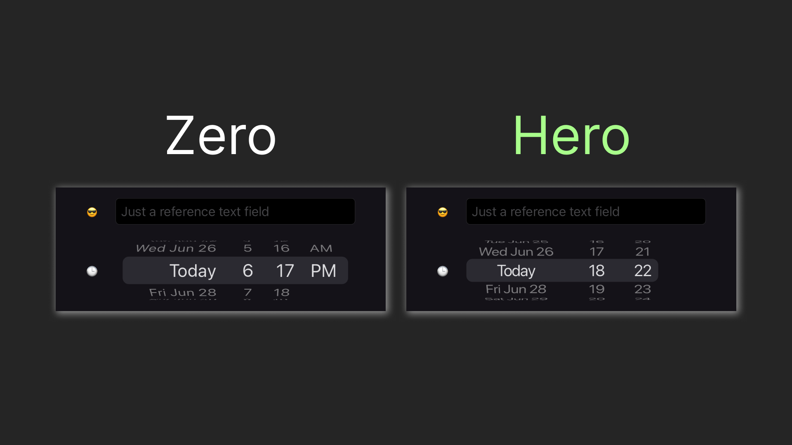
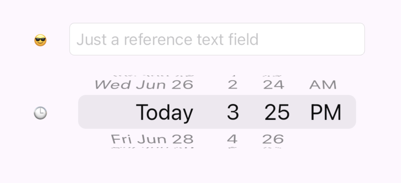
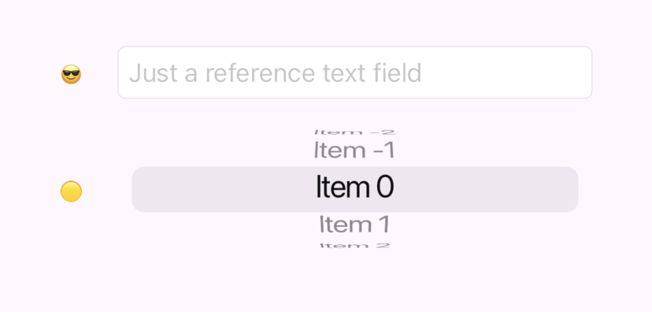
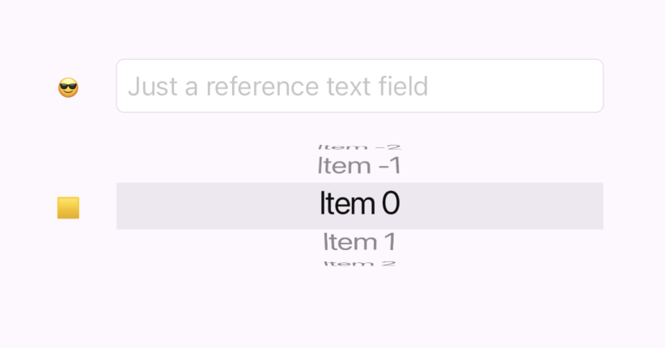
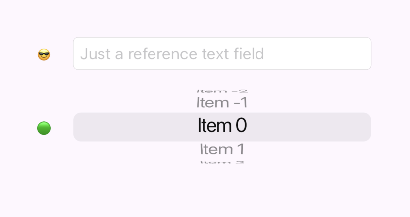
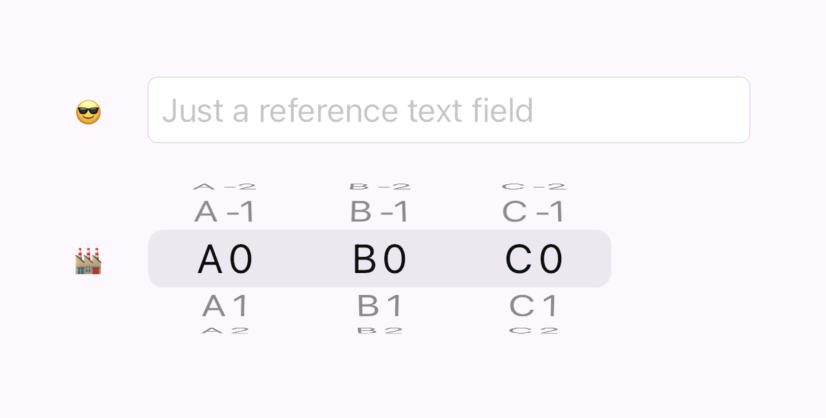
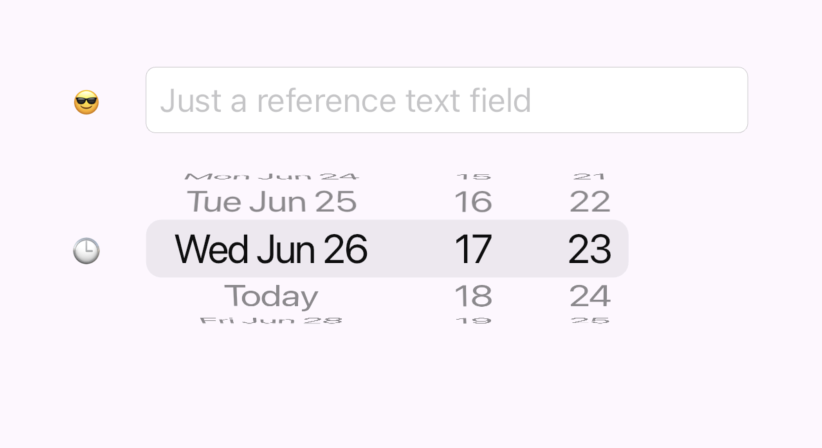

# Customizing CupertinoDatePicker in Flutter

`CupertinoDatePicker` is, perhaps, the most minimalistic date picker in Flutter, it not only plays nicely with other iOS-styled widgets but also looks pretty organic with material widgets. Notably, unlike material picker, it can be embedded directly in a form, without a modal window. In this article, we'll investigate different ways of using the `CupertinoDatePicker` ~~and create a better one~~.



## Playing with the Picker

Let's say we have a form with a simple text field row and the date picker row:

```dart
class CupertinoReferenceTextFieldRow extends StatelessWidget {
  const CupertinoReferenceTextFieldRow({
    super.key,
  });

  @override
  Widget build(BuildContext context) {
    return Row(
      children: [
        const Text('😎'),
        const SizedBox(width: 20),
        Expanded(child: CupertinoTextField(
          placeholder: 'Just a reference text field',
        )),
      ],
    );
  }
}

class DatePickerRow extends StatelessWidget {
  const DatePickerRow({
    super.key,
  });

  @override
  Widget build(BuildContext context) {
    return Row(
      children: [
        const Text('🕒'),
        const SizedBox(width: 20),
        Expanded(
          child: SizedBox(
            height: 80,
            child: CupertinoDatePicker(
              onDateTimeChanged: (value) {},
            ),
          ),
        ),
      ],
    );
  }
}
```

Wrapping them up in a column and giving them some space

```dart
Column(
  mainAxisAlignment: MainAxisAlignment.center,
  children: [
    CupertinoReferenceTextFieldRow(),
    const SizedBox(height: 20),
    DatePickerRow(),
  ],
);
```

Will give us the following form:



Although that form looks good enough, the fact that it is not aligned by the left side is pretty annoying. Let's figure out what we can do to tune that:


```dart
CupertinoDatePicker CupertinoDatePicker({
  Key? key,
  CupertinoDatePickerMode mode = CupertinoDatePickerMode.dateAndTime,
  required void Function(DateTime) onDateTimeChanged,
  DateTime? initialDateTime,
  DateTime? minimumDate,
  DateTime? maximumDate,
  int minimumYear = 1,
  int? maximumYear,
  int minuteInterval = 1,
  bool use24hFormat = false,
  DatePickerDateOrder? dateOrder,
  Color? backgroundColor,
  bool showDayOfWeek = false,
  double itemExtent = _kItemExtent,
})
```


Unfortunatelly, `CupertinoDatePicker` gives practically no way to customize it's look. The only thing we can do is to change `backgroundColor` and `itemExtent`, which is not something we were looking for. Why the widget has margins anyway? Well, we'll need to dive a little bit deeper. `CupertinoDatePicker` is essentially a set of `CupertinoPicker`s. Let's put a simple `CupertinoPicker` instead of the `CupertinoDatePicker` and see what we'll get

```dart
CupertinoPicker.builder(
  itemExtent: 30, 
  onSelectedItemChanged: (_) {}, 
  itemBuilder: (context, index) => Text('Item $index')
)
```



Aha, it's also margined it exactly the same way. This time the picker, provides sligtly more opportunity for customization, in particular the `selectionOverlay` property. If we'll disable edges capping:

```dart
selectionOverlay: CupertinoPickerDefaultSelectionOverlay(
  capStartEdge: false,
  capEndEdge: false,
),
```

We'll finally get our desired allignment:



But besides removing the annoying margins we also lost our rounding. This is due to the way `CupertinoPickerDefaultSelectionOverlay` works:

```dart
@override
Widget build(BuildContext context) {
  const Radius radius = Radius.circular(_defaultSelectionOverlayRadius);

  return Container(
    margin: EdgeInsetsDirectional.only(
      start: capStartEdge ? _defaultSelectionOverlayHorizontalMargin : 0,
      end: capEndEdge ? _defaultSelectionOverlayHorizontalMargin : 0,
    ),
    decoration: BoxDecoration(
      borderRadius: BorderRadiusDirectional.horizontal(
        start: capStartEdge ? radius : Radius.zero,
        end: capEndEdge ? radius : Radius.zero,
      ),
      color: CupertinoDynamicColor.resolve(background, context),
    ),
  );
}
```

## Customizing SelectionOverlay

Fortunatelly, the selection overlay code is trivial and `selectionOverlay` property accepts any `Widget`. So we can create our own more fluent version. Let's call it just `CupertinoPickerSelectionOverlay`:

```dart
import 'package:flutter/cupertino.dart';
import 'package:flutter/material.dart';

class CupertinoPickerSelectionOverlay extends StatelessWidget {
  final EdgeInsetsGeometry margin;
  final BorderRadiusGeometry borderRadius;
  final Color background;
  final BoxBorder? border;
  static const double _defaultSelectionOverlayRadius = 8;
  
  const CupertinoPickerSelectionOverlay({
    super.key,
    this.background = CupertinoColors.tertiarySystemFill,
    this.margin = const EdgeInsets.all(0),
    this.borderRadius = const BorderRadius.all(Radius.zero),
    this.border
  });  

  @override
  Widget build(BuildContext context) {
    return Container(
      margin: margin,
      decoration: BoxDecoration(
        borderRadius: borderRadius,
        border: border,
        color: CupertinoDynamicColor.resolve(background, context),
      ),
    );
  }
}
```

Now, applying it to our picker and rounding the border just a little bit

```dart
selectionOverlay: CupertinoPickerSelectionOverlay(
  borderRadius: BorderRadius.circular(8),
),
```

We'll finally achieve the version we need:



## Preparing the assembly line

Well, the date time picker is not a picker, but a set of pickers. We essentially have 3 pickers, where the first one have its left side rounded, the second one have strict side, and the third one has its right side rounded. Let's first create helper factories in `CupertinoPickerSelectionOverlay`:

```dart
factory CupertinoPickerSelectionOverlay.roundedLeftSide() {
  return const CupertinoPickerSelectionOverlay(
    borderRadius: BorderRadiusDirectional.horizontal(
      start: Radius.circular(_defaultSelectionOverlayRadius),
    ),
  );
}

factory CupertinoPickerSelectionOverlay.roundedRightSide() {
  return const CupertinoPickerSelectionOverlay(
    borderRadius: BorderRadiusDirectional.horizontal(
      end: Radius.circular(_defaultSelectionOverlayRadius),
    ),
  );
}
```

Let's first create a widget, allowing us to assemble pickers in a single line. The line's `selectionOverlay` should be drawn based on the `SelectionOverlayPosition` in the manner we've discussed earlier, essentially:

```dart
Widget _buildInlineSelectionOverlay(BuildContext context) =>
    selectionOverlayBuilder?.call(context, SelectionOverlayPosition.inline) ??
    CupertinoPickerSelectionOverlay();

Widget _buildLeftEdgeSelectionOverlay(BuildContext context) =>
    selectionOverlayBuilder?.call(context, SelectionOverlayPosition.leftEdge) ??
    CupertinoPickerSelectionOverlay.roundedLeftSide();
  
Widget _buildRightEdgeSelectionOverlay(BuildContext context) =>
    selectionOverlayBuilder?.call(context, SelectionOverlayPosition.rightEdge) ??
    CupertinoPickerSelectionOverlay.roundedRightSide();
```

The widget should also store selection index for each of the pickers. On a change the whole set should be presented to a parent widget (in our case that would help to get selected date, hour, and minute). This is a simple code to implement that:

```dart
var selectedIndexes = List.generate(itemsData.length, (index) => 0);

// In each CupertinoPicker
onSelectedItemChanged: (index) {
  selectedIndexes[i] = index;
  onSelectionChanged?.call(selectedIndexes);
}
```

Putting it together and allowing customizations of `itemExtent`, item's `width` and `height` we'll get this code:

```dart
import 'package:flutter/cupertino.dart';
import 'package:horology/cupertino_picker_selection_overlay.dart';

enum SelectionOverlayPosition {
  inline,
  leftEdge,
  rightEdge,
}

class CupertinoPickerLine extends StatelessWidget {
  final double height;
  final double itemExtent;
  final List<CupertinoPickerLineItemData> itemsData;
  final Widget Function(BuildContext, String)? itemBuilder;
  final Function(List<int>)? onSelectionChanged;
  final Widget Function(BuildContext, SelectionOverlayPosition)? selectionOverlayBuilder;
  
  const CupertinoPickerLine({
    super.key,
    required this.itemsData,
    this.itemBuilder,
    this.height = 50,
    this.itemExtent = 30,
    this.onSelectionChanged,
    this.selectionOverlayBuilder,
  });
  
  @override
  Widget build(BuildContext context) {
    var selectedIndexes = List.generate(itemsData.length, (index) => 0);

    List<Widget> children = [];

    for (int i = 0; i < itemsData.length; i++) {
      CupertinoPickerLineItemData item = itemsData[i];

      Widget selectionOverlay = _buildInlineSelectionOverlay(context);
      if (i == 0) selectionOverlay = _buildLeftEdgeSelectionOverlay(context);
      if (i == itemsData.length - 1) selectionOverlay = _buildRightEdgeSelectionOverlay(context);

      children.add(
        SizedBox(
          width: item.width,
          height: height,
          child: CupertinoPicker.builder(
            itemExtent: itemExtent,
            onSelectedItemChanged: (index) {
              selectedIndexes[i] = index;
              onSelectionChanged?.call(selectedIndexes);
            },
            scrollController: FixedExtentScrollController(initialItem: 0),
            selectionOverlay: selectionOverlay,
            itemBuilder: (context, index) {
              var text = item.itemTextBuilder(context, index);
              return text == null ? null : _buildItem(context, text);
            }
          ),
        ),
      );
    }

    return Row(
      children: children,
    );
  }

  Widget _buildInlineSelectionOverlay(BuildContext context) =>
      selectionOverlayBuilder?.call(context, SelectionOverlayPosition.inline) ??
      CupertinoPickerSelectionOverlay();

  Widget _buildLeftEdgeSelectionOverlay(BuildContext context) =>
      selectionOverlayBuilder?.call(context, SelectionOverlayPosition.leftEdge) ??
      CupertinoPickerSelectionOverlay.roundedLeftSide();
  
  Widget _buildRightEdgeSelectionOverlay(BuildContext context) =>
      selectionOverlayBuilder?.call(context, SelectionOverlayPosition.rightEdge) ??
      CupertinoPickerSelectionOverlay.roundedRightSide();

  Widget _buildItem(BuildContext context, String data) =>
      itemBuilder?.call(context, data) ??
      Center(
        child: Text(data),
      );
}

class CupertinoPickerLineItemData {
  final double width;
  final String? Function(BuildContext, int) itemTextBuilder;

  const CupertinoPickerLineItemData({
    this.width = 80,
    required this.itemTextBuilder,
  });
}
```

And this is what we can assemble using that line:



## The Final Touch

The `CupertinoPickerLine` already covers most of the logic we need to create our date time picker. The most fancy logic we have is bridging picker selection index to the actual date time. We'll need to convert from how much we moved from the initial value to the actual value, having in mind that our clock is circular so moving 80 minutes is as moving on 80 minutes. All this comes down to this code:

```dart
var zeroDateTime = initialDateTime ?? DateTime.now();

int hourFromIndex(int index) => (zeroDateTime.hour + index) % 24;
int minuteFromIndex(int index) => (zeroDateTime.minute + index) % 60;

var selectedDateOnly = zeroDateTime.add(Duration(days: indexes[0]));
var selectedHour = hourFromIndex(indexes[1]);
var selectedMinute = minuteFromIndex(indexes[2]);
var selected = DateTime(
  selectedDateOnly.year, 
  selectedDateOnly.month, 
  selectedDateOnly.day, 
  selectedHour, 
  selectedMinute
);
```

One more cherry on top is how we render the picker date, including showing "Today" for current date:

```dart
var localization = CupertinoLocalizations.of(context);
var selectedDate = zeroDateTime.add(Duration(days: index));
var selectedDateString = localization.datePickerMediumDate(selectedDate);
var nowDateString = localization.datePickerMediumDate(DateTime.now());
      
if (selectedDateString == nowDateString) return localization.todayLabel;
            
return selectedDateString;
```

Finally, let's pack all this up in a single widget. Fortunatelly, `CupertinoDateTimePicker` (which is more precise name in my view) is not occupied, so, let's just use it:

```dart
import 'package:flutter/cupertino.dart';
import 'package:horology/cupertino_picker_line.dart';

class CupertinoDateTimePicker extends StatelessWidget {
  final Function(DateTime)? onSelectionChanged;
  final DateTime? initialDateTime;
  final Widget Function(BuildContext, SelectionOverlayPosition)? selectionOverlayBuilder;
  final double height;

  const CupertinoDateTimePicker({
    super.key,
    this.onSelectionChanged,
    this.initialDateTime,
    this.selectionOverlayBuilder,
    this.height = 50,
  });
  
  @override
  Widget build(BuildContext context) {
    var zeroDateTime = initialDateTime ?? DateTime.now();

    int hourFromIndex(int index) => (zeroDateTime.hour + index) % 24;
    int minuteFromIndex(int index) => (zeroDateTime.minute + index) % 60;

    return CupertinoPickerLine(
      height: height,
      selectionOverlayBuilder: selectionOverlayBuilder,
      onSelectionChanged: (indexes) {
        var selectedDateOnly = zeroDateTime.add(Duration(days: indexes[0]));
        var selectedHour = hourFromIndex(indexes[1]);
        var selectedMinute = minuteFromIndex(indexes[2]);
        var selected = DateTime(
          selectedDateOnly.year, 
          selectedDateOnly.month, 
          selectedDateOnly.day, 
          selectedHour, 
          selectedMinute
        );
    
        onSelectionChanged?.call(selected);
      },
      itemsData: [
        CupertinoPickerLineItemData(
          width: 130, 
          itemTextBuilder: (context, index) {
            var localization = CupertinoLocalizations.of(context);
            var selectedDate = zeroDateTime.add(Duration(days: index));
            var selectedDateString = localization.datePickerMediumDate(selectedDate);
            var nowDateString = localization.datePickerMediumDate(DateTime.now());
      
            if (selectedDateString == nowDateString) return localization.todayLabel;
            
            return selectedDateString;
          },
        ),
        CupertinoPickerLineItemData(
          width: 80, 
          itemTextBuilder: (context, index) {
            var hours = (zeroDateTime.hour + index) % 24;
            return hours.toString().padLeft(2, '0');
          },
        ),
        CupertinoPickerLineItemData(
          width: 40, 
          itemTextBuilder: (context, index) {
            var minutes = (zeroDateTime.minute + index) % 60;
            return minutes.toString().padLeft(2, '0');
          },
        ),
      ],
    );
  }
}
```

Using our updated date time picker is even simpler then the built-in one. Here's how the field row code look like now:

```dart
Row(
  mainAxisAlignment: MainAxisAlignment.start,
  children: [
    const Text('🕒'),
    const SizedBox(width: 20),
    CupertinoDateTimePicker(
      height: 80,
      initialDateTime: DateTime.now(),
      onSelectionChanged: (value) {
        print(value);
      },
    ),
  ],
);
```

And finally here's our updated aligned look:



## The result 

We've investigated `CupertinoDatePicker` and found out its limitations. To overcome those, we went with creating our custom `CupertinoDateTimePicker`, crafting `CupertinoPickerSelectionOverlay` and `CupertinoPickerLine` along the way. Here's our journey in a gif:


You can find the playground app code in [this repo](https://github.com/astorDev/horology). You can also get `CupertinoDateTimePicker` by adding [this package](https://pub.dev/packages/horology) as a dependency.

And one more thing... claps are appreciated 👉👈
